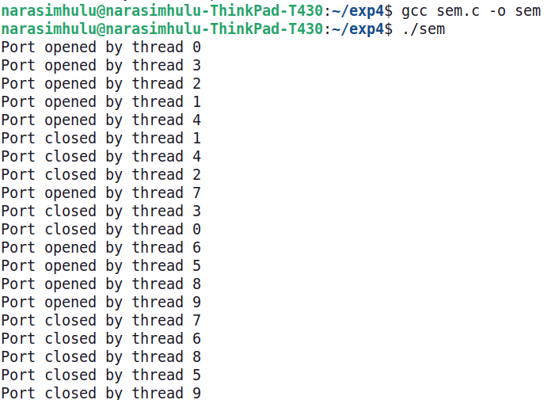
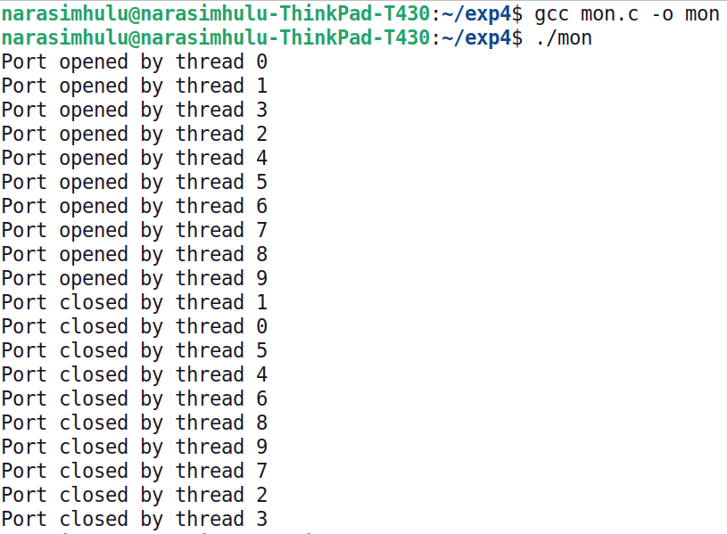

# Contral the number of ports opened systems with a) Semephore b) Monitor
# Prgram description
# ✅ Semaphores, Monitors, and Ports in Operating Systems

These are key concepts in **process synchronization** and **resource management** in operating systems. Let's break them down with examples and comparisons. 

---

## 1️⃣ Semaphores

### 🔍 Definition:
A **semaphore** is a synchronization primitive used to control access to a shared resource in a concurrent system. It’s essentially an **integer variable** that supports two atomic operations:
- **`wait()` (also called `P()` or `down`)**: Decreases the semaphore value. If the value is **0**, the process waits until it becomes positive.
- **`signal()` (also called `V()` or `up`)**: Increases the semaphore value, potentially waking up waiting processes.

### 🚦 Types of Semaphores:
1. **Counting Semaphore:** Can take any non-negative integer value. Useful for managing multiple identical resources (like ports).
2. **Binary Semaphore (Mutex):** Takes only `0` or `1`—used for mutual exclusion.

### ⚙️ Key Takeaways:
- Controls access to shared resources.
- Ensures synchronization in concurrent systems.

---

## 2️⃣ Monitors

### 🔍 Definition:
A **monitor** is a high-level synchronization construct that manages access to shared resources. It combines:
- **Mutual Exclusion:** Only one process can execute inside the monitor at a time.
- **Condition Variables:** Allow threads to **wait** (using `wait()`) and **signal** others when conditions change (using `signal()` or `notify()`).

### 🧰 Structure of a Monitor:
- **Shared Variables:** Represent the resource (e.g., available ports).
- **Mutex (Lock):** To ensure exclusive access.
- **Condition Variables:** To manage waiting threads.

### ⚙️ Key Takeaways:
- Ensures mutual exclusion and condition synchronization.
- Simplifies complex process synchronization.

---

## 3️⃣ Ports

### 🔍 Definition:
In computing, a **port** is a communication endpoint used for data exchange between:
- Processes (Inter-Process Communication)
- Devices
- Networks (TCP/UDP ports in networking)

### 🚪 Types of Ports:
1. **Hardware Ports:** Physical connection interfaces (USB, HDMI).
2. **Software Ports:** Logical endpoints used for network communication (like port 80 for HTTP).

### 📊 Role of Ports in Resource Management:
- Ports are **finite resources** (limited number).
- OS must manage ports efficiently to avoid conflicts (e.g., two apps can’t bind to the same TCP port).

---

## 🚀 Semaphores vs. Monitors vs. Ports

| **Aspect**       | **Semaphore**                    | **Monitor**                        | **Port**                           |
|------------------|---------------------------------|------------------------------------|------------------------------------|
| **Purpose**       | Low-level synchronization       | High-level synchronization         | Endpoint for communication         |
| **Type**          | Integer with `wait/signal` ops  | Object with locks & condition vars | Resource (hardware/software)        |
| **Concurrency**   | Controls resource count         | Ensures mutual exclusion + waiting | Manages data flow between entities  |
| **Blocking**      | Manual handling with semaphores | Built-in with `wait()`/`signal()`   | Depends on system/network settings  |
| **OS Example**    | Process synchronization         | Thread-safe access to shared data  | Network socket or device interface  |

---

## 💡 Real-World Example:

Imagine **5 people** trying to use **3 charging ports** at an airport:

- **Semaphore:** A token system where each person grabs a token to charge. If no tokens are left, they wait.
- **Monitor:** A manager at the charging station allows one person at a time to check if a port is free. If not, the person waits in line, and the manager signals the next when a port frees up.
- **Port:** The actual charging slot used to plug in the charger.

---

Let me know if you'd like to dive deeper into any specific part! 🚀

# Source Code a) Semaphore
```c
#include <stdio.h>
#include <unistd.h>
#include <pthread.h>
#include <semaphore.h>

#define MAX_PORTS 5  // Maximum number of ports allowed
sem_t port_semaphore; // Semaphore to control port access

void* open_port(void* arg) {
    sem_wait(&port_semaphore); // Wait if no port is available
    printf("Port opened by thread %ld\n", (long)arg);
    
    // Simulate port usage
    sleep(2);
    
    printf("Port closed by thread %ld\n", (long)arg);
    sem_post(&port_semaphore); // Release the port
    return NULL;
}

int main() {
    pthread_t threads[10];
    sem_init(&port_semaphore, 0, MAX_PORTS); // Initialize semaphore with MAX_PORTS

    for (long i = 0; i < 10; i++) {
        pthread_create(&threads[i], NULL, open_port, (void*)i);
    }

    for (int i = 0; i < 10; i++) {
        pthread_join(threads[i], NULL);
    }

    sem_destroy(&port_semaphore);
    return 0;
}
```
# Output


# b) Source Code for Monitors
```c
#include <stdio.h>
#include <pthread.h>
#include <unistd.h>  // For sleep()

#define MAX_OPEN_PORTS 5  // Define the maximum number of allowed open ports

// Monitor structure to manage ports
typedef struct {
    int available_ports;
    pthread_mutex_t mutex;
    pthread_cond_t condition;
} PortMonitor;

// Function to initialize the monitor
void init_monitor(PortMonitor* monitor) {
    monitor->available_ports = MAX_OPEN_PORTS;
    pthread_mutex_init(&monitor->mutex, NULL);
    pthread_cond_init(&monitor->condition, NULL);
}

// Function to open a port (monitor-like behavior)
void open_port(PortMonitor* monitor, int thread_id) {
    pthread_mutex_lock(&monitor->mutex);  // Enter critical section

    while (monitor->available_ports == 0) {
        pthread_cond_wait(&monitor->condition, &monitor->mutex);  // Wait if no ports are available
    }
    monitor->available_ports--;  // Allocate a port
    printf("Port opened by thread %d\n", thread_id);

    pthread_mutex_unlock(&monitor->mutex);  // Exit critical section
}

// Function to close a port (monitor-like behavior)
void close_port(PortMonitor* monitor, int thread_id) {
    pthread_mutex_lock(&monitor->mutex);  // Enter critical section

    monitor->available_ports++;  // Release the port
    printf("Port closed by thread %d\n", thread_id);
    pthread_cond_signal(&monitor->condition);  // Notify waiting threads

    pthread_mutex_unlock(&monitor->mutex);  // Exit critical section
}

// Thread function
void* port_handler(void* arg) {
    int thread_id = *(int*)arg;
    static PortMonitor monitor = {0};  // Shared monitor instance

    // Initialize monitor only once (for the first thread)
    if (monitor.available_ports == 0) {
        init_monitor(&monitor);
    }

    open_port(&monitor, thread_id);
    sleep(2);  // Simulate port usage
    close_port(&monitor, thread_id);

    return NULL;
}

int main() {
    pthread_t threads[10];
    int thread_ids[10];

    for (int i = 0; i < 10; i++) {
        thread_ids[i] = i;
        pthread_create(&threads[i], NULL, port_handler, &thread_ids[i]);
    }

    for (int i = 0; i < 10; i++) {
        pthread_join(threads[i], NULL);
    }

    return 0;
}
```

